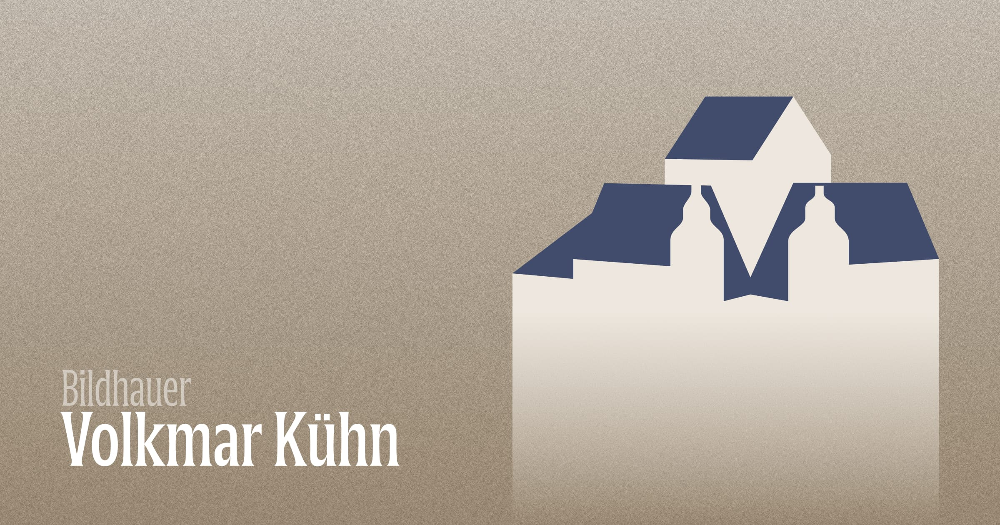

[](https://bildhauer-volkmar-kuehn.de)

# Bildhauer Volkmar Kühn

## What is this?

This is the website source code for the sculptor [Volkmar Kühn](https://de.wikipedia.org/wiki/Volkmar_K%C3%BChn), a German sculptor known for his works displayed in public spaces, particularly in Gera (the town I grew up in). Since 1968, he has been living and working in the former Mildenfurth monastery, which the logo represents.

The artist lacks exposure on the interweb, so I decided to build a website for him during Easter 2023. The website is built with [Kirby](https://getkirby.com), [Vite](https://vitejs.dev) and [UnoCSS](https://unocss.dev).

## Installation

1. Duplicate the [`.env.development.example`](./.env.development.example) as `.env`:
   ```bash
   cp .env.development.example .env
   ```
2. Install the required Node dependencies:
   ```bash
   pnpm install
   ```
3. Install the required Composer dependencies:
   ```bash
   composer install
   ```

## Usage

### Development

1. Start the Vite development server and watch for file changes accordingly:
   ```bash
   pnpm dev
   ```
2. Run the built-in PHP web server or use a development web server of your choice (like [Laravel Valet](https://laravel.com/docs/10.x/valet)).
   ```bash
   composer start
   ```

### Production

Build the frontend assets for production:

```bash
pnpm build
```

If you have caching enabled, make sure to wipe the cache after each build:

```bash
rm -rf storage/cache/<your-website>
```

### Deployment

> [!TIP]
> See [ploi-deploy.sh](./scripts/ploi-deploy.sh) for deployment instructions.

> [!NOTE]
> For Apache web servers: Some hosting environments require uncommenting `RewriteBase /` in [`.htaccess`](./public/.htaccess) to make site links work.

## License

The code is licensed under [MIT](./LICENSE), words and images are licensed under [CC BY-NC-SA 4.0](https://creativecommons.org/licenses/by-nc-sa/4.0/).

© 2023-PRESENT [Johann Schopplich](https://github.com/johannschopplich)
